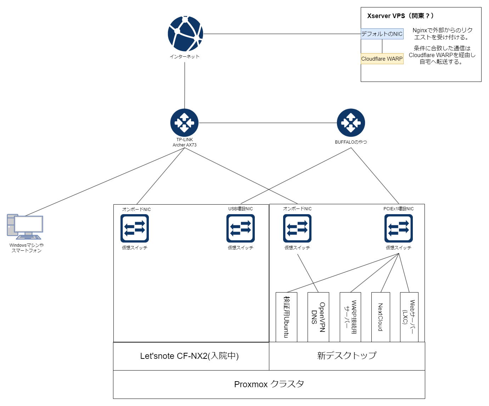
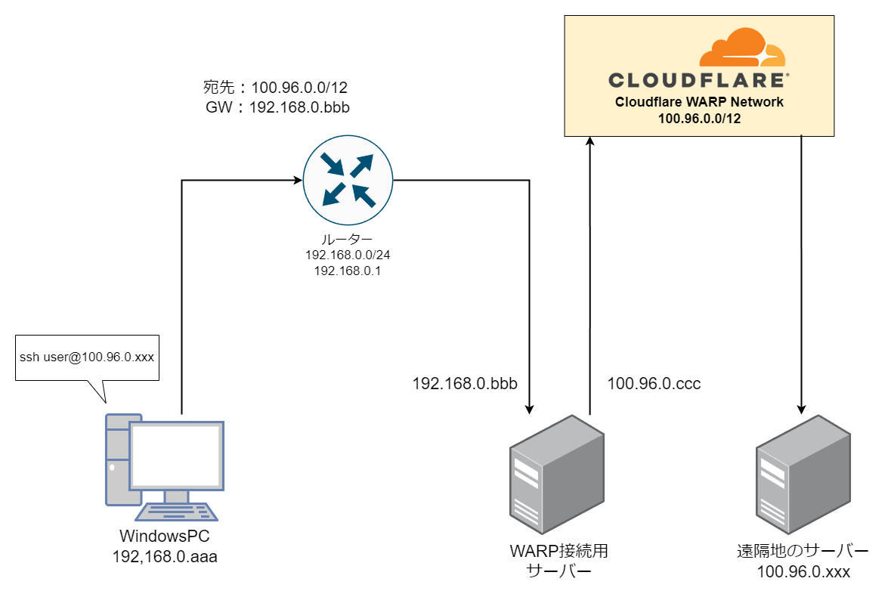

# 楽しい自宅サーバー
自宅サーバーについての解説とメモです。

ツッコミどころ満載ですがご容赦ください。

## 目次
- [楽しい自宅サーバー](#楽しい自宅サーバー)
  - [目次](#目次)
  - [なぜこんなことになったのか](#なぜこんなことになったのか)
    - [2019年](#2019年)
    - [2021年](#2021年)
    - [2023年](#2023年)
  - [現在の構成！](#現在の構成)
  - [物理機器](#物理機器)
    - [TP-LINK ArcherAX73](#tp-link-archerax73)
      - [分類](#分類)
      - [役割](#役割)
    - [BUFFALOのやつ](#buffaloのやつ)
      - [分類](#分類-1)
      - [役割](#役割-1)
    - [Let'snote](#letsnote)
      - [分類](#分類-2)
      - [役割](#役割-2)
      - [メモ](#メモ)
      - [リンク集](#リンク集)
    - [新デスクトップ](#新デスクトップ)
      - [分類](#分類-3)
      - [役割](#役割-3)
  - [仮想マシン・サービス](#仮想マシンサービス)
    - [検証用Ubuntu](#検証用ubuntu)
      - [分類](#分類-4)
      - [システム](#システム)
      - [役割](#役割-4)
    - [VPN DNS](#vpn-dns)
      - [分類](#分類-5)
      - [システム](#システム-1)
      - [役割](#役割-5)
      - [OpenVPN](#openvpn)
      - [DNSサーバー](#dnsサーバー)
    - [WARP接続用サーバー](#warp接続用サーバー)
      - [分類](#分類-6)
      - [システム](#システム-2)
      - [役割](#役割-6)

## なぜこんなことになったのか
初心忘るべからず

### 2019年
高校１年生のとき、友人からのプレゼントで128GBのSSDを貰いました。

そのSSDにPCやスマホから接続しようと、中古のラズパイ3でNASを構築したのがエンジニアごっこの始まりです。

NASを運用するにつれ、次のようなことを考え始めます

* ラズパイ3の性能ではネットワークや電源周りが不安定
* 外出先からでも接続できるようにしよう
* Pi-HoleというDNSサーバー(後述)があるらしい
* 自作のPythonスクリプトを動かしたい
* Linuxサーバーで遊びたいが、壊してもいいマシンが無い

### 2021年
メルカリで中古のデスクトップPCを見つけて購入しました。

元々はWindows7を搭載していたので、スペックは中の下ぐらいです。

それにUbuntu Desktopをインストールし自宅サーバーとして運用していました。

OpenVPN、DNS、Samba、Pythonなどのサービスを運用するサーバーとして利用していたのですが、`ひとつトラブルが発生すると他のサービスにまで影響を及ぼす`という問題を抱えていました。

あとRAMの認識が甘く、4GBしか認識できなくなった。

RDPもうまくいかないし保守性が終わってました。

### 2023年
ついに革命が起きます。

それは`Proxmox`という仮想化基盤を導入したことです。

* ブラウザで管理できる
* VMとLXCによりサービスを分離することができる
* VMやLXC丸々のバックアップ/リストアが可能
* サービスを停止させることなくホコリ掃除ができる(マイグレート)

これが無料ってマ？

VMが利用できるようになり、リスクを伴う検証が気軽にできるようになりました。

あれこれ考えるの本当に楽しいです。

## 現在の構成！

Proxmoxをインストールしたマシンを２台用意しクラスタを形成しています。

ただしLet'snoteは入院中なため、デスクトップPC１台で運用しています。

## 物理機器
ここからは自分用のメモを含んでいます。

### TP-LINK ArcherAX73
#### 分類
* ネットワーク機器

#### 役割
* 家族全員で利用している無線LANルーター
* ISPに繋がっている
### BUFFALOのやつ
#### 分類
* ネットワーク機器
#### 役割
* Archerへの負荷を軽減するため、検証系や速度を要求しないサーバーまとめる
  
### Let'snote
#### 分類
* 物理ノード
#### 役割
* Proxmoxを実行する
* メインのデスクトップPCをメンテナンスするときにVMを移動させサービスを継続する

#### メモ
* 故障したためクラスタから切断したが、近日復帰予定
#### リンク集
* ノード切断で困っていたときにした質問
* [Unable to remove a node from the cluster. - reddit](https://www.reddit.com/r/Proxmox/comments/196enuk/unable_to_remove_a_node_from_the_cluster/)

### 新デスクトップ
#### 分類
* 物理ノード
#### 役割
* Proxmoxの実行
* 肝　心臓　命　死守

## 仮想マシン・サービス
Proxmoxで実行している仮想マシン等です

上記の画像に準じます

### 検証用Ubuntu
#### 分類
* VM
#### システム
* Ubuntu Server x64
* docker-compose
#### 役割
* 様々な検証をするやつ。
* 壊しすぎて何度リストアしたか

### VPN DNS
#### 分類
* VM
#### システム
* Ubuntu Server x64

#### 役割
* 自宅サーバーへVPN接続するOpenVPNサーバー
* 広告ブロッカー[Pi-hole®](https://pi-hole.net/)を実行するDNSサーバー

#### OpenVPN
* [PiVPN](https://www.pivpn.io/)というソフトウェアを使用しています
* ただのVPNサーバーですが、事情があり変な形になっています
    * [詳細 - VPNServer.md](Supplementary/VPNServer.md)
#### DNSサーバー
* DNSサーバーとして指定すると、広告ブロッカーとなるOSSです
* 円安時でもドネートしてしまうぐらい最高です

### WARP接続用サーバー
#### 分類
* VM
#### システム
* Ubuntu Server x64
#### 役割
* Cloudflare社が提供しているサービス`WARP-to-WARP`で構築したネットワークに、ローカルから接続するためのNAT要員
  * [Weave your own global, private, virtual Zero Trust network on Cloudflare with WARP-to-WARP - The Cloudflare Blog](https://blog.cloudflare.com/warp-to-warp)
  * 
* 遠隔地に存在する機器にローカルに存在するかのようなノリでアクセスできる
