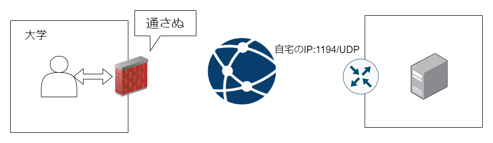
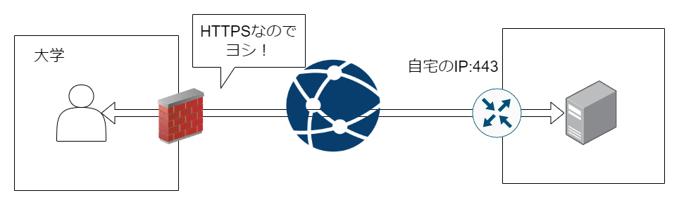
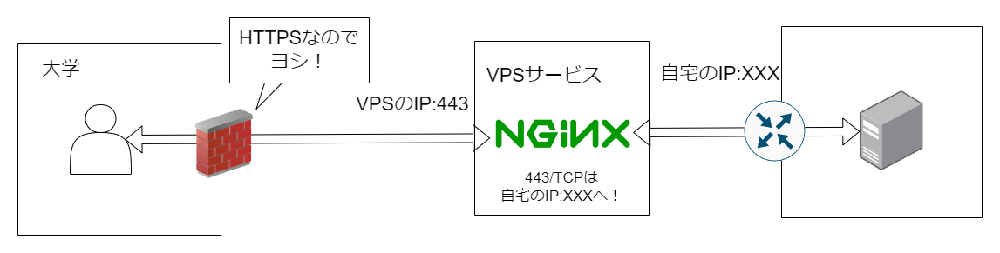
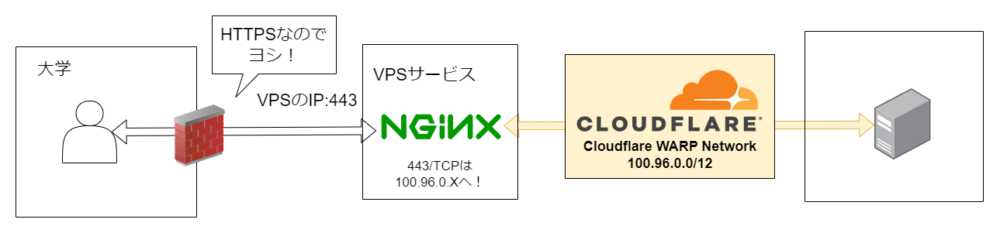

# VPNサーバーについて

至って普通のOpenVPNサーバーですが、ある事情から変な構成になっています。

なんだかんだで一番苦労したかも

## 「ある事情」
ずばりファイアウォールです。

大学のネットワーク内から自宅にVPN接続したくなることがあります。

* ProxmoxのコントロールパネルやSSHに接続するとき
* Pi-holeの機能を利用したいとき
* 自宅のグローバルIPアドレスが必要なとき
* 検閲対策

しかし組織のFWは厳密に設定されていて、特定サービス以外はインターネットに出ることができません。

* 例：リッスンポート変更したSSHサーバに接続できない
* 例：ゲームのマルチプレイサービスに接続できない

当然ながらOpenVPNのデフォルトポートである`1194/UDP`も規制されているようで、VPNサーバーに到達できません。


そこで、HTTPSを利用してVPN接続を行うことにしました。
  * そもそもVPNが禁止な可能性も考えられるが、、、

## 変更１ HTTPSを利用する
組織のネットワークといえど普通にネットサーフィンが可能です。

つまりHTTPS(443/TCP)に向けた通信は可能ではないかと考えました。

検閲やVPNが禁止されている国でよく行われる手法らしいです。



しかしこの方法だと次のような問題が発生します
* HTTPSに対応したWebページの公開ができない
  * OpenVPNが443/TCPを利用するため
* そもそもHTTPSを開放するのは危険
  * 同時期にクラウド上で公開していたWebサーバーは攻撃らしきアクセスを多数受けて怖くなり閉鎖した

## 変更２ VPSを経由する
NGINXによるTCPプロキシサーバーを建てました。

自宅の443/TCPを開放するのではなく、別のサーバーで443/TCPをリッスンし、ポートを書きかけて自宅に接続するようにしました。

NGINX上でフィルタを設定すると、意図しない接続は自宅サーバーへ届きません。



1. VPNクライアントは`VPSのIPアドレス:443`に接続を試みる
2. 通信を受け取ったNGINXは、フィルターに合致しない通信を破棄する。
3. 通過した通信を`自宅のIPアドレス:XXX`へ転送する
4. VPNサーバーとの通信を開始する

自宅の443/TCPは閉鎖できましたが、すべてのポートを閉鎖したいと考えていました。
* ファイアウォールで接続元を絞っているとはいえ、意図しない通信を自宅サーバーに入れたくない

VPNサーバーのファイアウォールで接続元IPを絞ることで少しはマシになります。

```bash
$ sudo ufw allow from VPSのIP to any port XXX
```

## 現状 Cloudflareを経由する
Cloudflare ZeroTrustの中で`WARP`というサービスを発見しました。

WARPとはCloudflare社の`1.1.1.1`へ接続することができるいい感じなVPNツールですが、チームを作成し独自のプライベートネットワークを作成することが可能です。

WARPでチームを作成し、VPSと自宅を接続すれば安全に遠隔地と通信することができます。

* [Weave your own global, private, virtual Zero Trust network on Cloudflare with WARP-to-WARP - The Cloudflare Blog](https://blog.cloudflare.com/warp-to-warp)

* [Create private networks with WARP-to-WARP - Cloudflare docs](https://developers.cloudflare.com/cloudflare-one/connections/connect-networks/private-net/warp-to-warp/)

* [Cloudflare Zero Trust 経由でAWS上のEC2（グローバルIPアドレス無し）にSSHでログインする - Zenn](https://zenn.dev/hiroe_orz17/articles/b028fdb5444ee0)

Cloudflareのデータセンターは日本にも存在するため遅延は小さいです。



1. VPNクライアントは`VPSのIPアドレス:443`に接続する
2. 通信を受け取ったNGINXは、フィルターに合致しない通信を破棄する
3. フィルターを通過した通信をWARPネットワーク`100.96.0.X`へプロキシ
4. VPNサーバとの接続を開始する

Cloudflareのサーバーとコネクションを張るため、自宅ポートの開放が不要になりました。

## まとめ
インターネットは怖いです。

Webサーバーやゲームサーバーなどの公開サービスを構築するのは楽しいですが、ある程度セキュリティ対策が必要です。

VPSの契約やCloudflareなどネットワーク事業者を頼ることも重要なんだと実感できました。素人には無理です。

終わり！